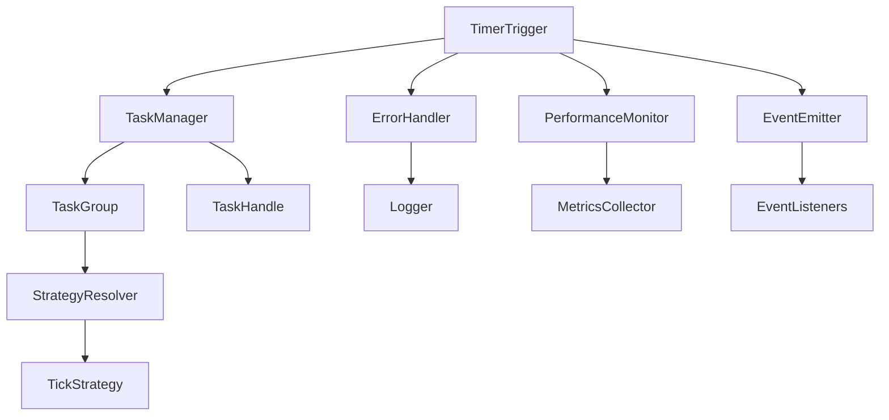

# Design Document

## Overview

本设计文档描述了 timer-trigger 库的优化方案。优化将在保持现有 API 兼容性的基础上，增强错误处理、性能监控、类型安全、配置灵活性等方面的能力。设计采用渐进式改进策略，确保现有用户可以平滑升级。

## Architecture

### 核心架构保持不变

现有的三层架构将继续保持：
- **TimerTrigger 主接口层**：用户交互的主要入口
- **TaskGroup 任务组管理层**：管理相同目标时间的任务集合
- **Strategy 策略层**：决定时钟检查的延迟策略

### 新增组件



## Components and Interfaces

### 1. 增强的错误处理系统

```typescript
interface ErrorContext {
  operation: string;
  targetTime?: number;
  taskId?: string;
  timestamp: number;
  stack?: string;
}

interface TimerTriggerError extends Error {
  context: ErrorContext;
  code: string;
}

class ErrorHandler {
  private logger?: Logger;
  
  constructor(logger?: Logger) {
    this.logger = logger;
  }
  
  handleError(error: Error, context: ErrorContext): TimerTriggerError;
  validateTime(time: number | string | Date): number;
  wrapCallback(callback: () => void, context: ErrorContext): () => void;
}
```

### 2. 性能监控系统

```typescript
interface PerformanceMetrics {
  totalTasks: number;
  completedTasks: number;
  averageDeviation: number;
  maxDeviation: number;
  slowTasks: number;
  memoryUsage: {
    activeTaskGroups: number;
    totalTasks: number;
  };
}

interface TaskExecutionMetrics {
  taskId: string;
  targetTime: number;
  actualTime: number;
  deviation: number;
  executionDuration: number;
}

class PerformanceMonitor {
  private metrics: PerformanceMetrics;
  private executionHistory: TaskExecutionMetrics[];
  
  recordTaskExecution(metrics: TaskExecutionMetrics): void;
  getMetrics(): PerformanceMetrics;
  checkPerformanceWarnings(): string[];
  reset(): void;
}
```

### 3. 任务生命周期管理

```typescript
enum TaskStatus {
  PENDING = 'pending',
  EXECUTING = 'executing',
  COMPLETED = 'completed',
  CANCELLED = 'cancelled',
  PAUSED = 'paused'
}

interface TaskHandle {
  readonly id: string;
  readonly targetTime: number;
  readonly status: TaskStatus;
  cancel(): boolean;
  pause(): boolean;
  resume(): boolean;
  getInfo(): TaskInfo;
}

interface TaskInfo {
  id: string;
  targetTime: number;
  status: TaskStatus;
  createdAt: number;
  remainingMs: number;
  executionCount: number;
}

interface LifecycleHooks {
  onTaskCreated?: (handle: TaskHandle) => void;
  onTaskExecuting?: (handle: TaskHandle) => void;
  onTaskCompleted?: (handle: TaskHandle) => void;
  onTaskCancelled?: (handle: TaskHandle) => void;
  onTaskError?: (handle: TaskHandle, error: Error) => void;
}
```

### 4. 事件系统

```typescript
interface TimerTriggerEvents {
  'task:created': (handle: TaskHandle) => void;
  'task:executing': (handle: TaskHandle) => void;
  'task:completed': (handle: TaskHandle) => void;
  'task:cancelled': (handle: TaskHandle) => void;
  'task:error': (handle: TaskHandle, error: Error) => void;
  'performance:warning': (warning: string) => void;
  'strategy:changed': (oldStrategy: string, newStrategy: string) => void;
}

class EventEmitter<T extends Record<string, (...args: any[]) => void>> {
  on<K extends keyof T>(event: K, listener: T[K]): () => void;
  off<K extends keyof T>(event: K, listener: T[K]): void;
  emit<K extends keyof T>(event: K, ...args: Parameters<T[K]>): void;
  removeAllListeners(event?: keyof T): void;
}
```

### 5. 增强的配置系统

```typescript
interface StrategyConfig {
  precisionThreshold: number;
  customStrategies?: Map<string, TickStrategy>;
  defaultStrategy?: string;
}

interface TimerTriggerConfig {
  debug?: boolean;
  logger?: Logger;
  strategy?: StrategyConfig;
  performance?: {
    enableMonitoring: boolean;
    slowTaskThreshold: number;
    maxTaskGroups: number;
  };
  lifecycle?: LifecycleHooks;
}

interface Logger {
  debug(message: string, ...args: any[]): void;
  info(message: string, ...args: any[]): void;
  warn(message: string, ...args: any[]): void;
  error(message: string, ...args: any[]): void;
}
```

### 6. 批量操作接口

```typescript
interface BatchTaskOptions {
  tasks: Array<{
    targetTime: number | string | Date;
    callback: () => void;
    id?: string;
  }>;
  onProgress?: (completed: number, total: number) => void;
  onError?: (error: Error, taskIndex: number) => void;
}

interface BatchResult {
  successful: TaskHandle[];
  failed: Array<{ index: number; error: Error }>;
  totalCount: number;
}

interface TaskFilter {
  status?: TaskStatus[];
  timeRange?: { start: number; end: number };
  ids?: string[];
}
```

## Data Models

### 增强的 TaskGroup

```typescript
class EnhancedTaskGroup extends TimeTriggerTaskGroup {
  private readonly id: string;
  private status: TaskStatus;
  private createdAt: number;
  private pausedAt?: number;
  private executionMetrics: TaskExecutionMetrics[];
  
  constructor(
    targetTime: number,
    resolver: TickStrategyResolver,
    private monitor: PerformanceMonitor,
    private eventEmitter: EventEmitter<TimerTriggerEvents>
  );
  
  pause(): boolean;
  resume(): boolean;
  getMetrics(): TaskExecutionMetrics[];
}
```

### 任务句柄实现

```typescript
class TaskHandleImpl implements TaskHandle {
  constructor(
    public readonly id: string,
    public readonly targetTime: number,
    private taskGroup: EnhancedTaskGroup,
    private callback: () => void
  );
  
  get status(): TaskStatus;
  cancel(): boolean;
  pause(): boolean;
  resume(): boolean;
  getInfo(): TaskInfo;
}
```

## Correctness Properties

*A property is a characteristic or behavior that should hold true across all valid executions of a system-essentially, a formal statement about what the system should do. Properties serve as the bridge between human-readable specifications and machine-verifiable correctness guarantees.*

现在我需要使用 prework 工具来分析需求中的验收标准，以便生成正确的属性。

基于需求分析，以下是核心的正确性属性：

### Property 1: 错误处理和隔离
*For any* 无效输入或异常回调函数，系统应该正确处理错误、记录详细信息（在 debug 模式下）并隔离错误不影响其他任务的执行
**Validates: Requirements 1.1, 1.2, 1.4**

### Property 2: 性能监控和统计
*For any* 执行的任务，系统应该正确记录执行指标（时间偏差、执行时长）并提供准确的统计数据（平均偏差、最大偏差、慢任务计数）
**Validates: Requirements 2.1, 2.2, 2.4**

### Property 3: 资源监控和警告
*For any* 系统状态，当资源使用（任务组数量、内存使用）超过配置的阈值时，系统应该触发相应的警告
**Validates: Requirements 1.3, 2.3**

### Property 4: 策略配置和切换
*For any* 自定义配置（精度阈值、自定义策略、预设配置），系统应该正确应用配置并在策略切换时保持已注册任务的正常执行
**Validates: Requirements 4.1, 4.2, 4.3, 4.4**

### Property 5: 任务生命周期管理
*For any* 注册的任务，系统应该返回有效的任务句柄、正确跟踪任务状态变化、触发生命周期钩子并支持暂停恢复操作
**Validates: Requirements 5.1, 5.2, 5.3, 5.4**

### Property 6: 内存管理和资源清理
*For any* 完成、取消或批量清理的任务，系统应该立即清理相关的内存引用、定时器和回调，确保没有资源泄漏
**Validates: Requirements 8.1, 8.2, 8.4**

### Property 7: 调试支持和日志记录
*For any* 在 debug 模式下的操作（任务注册、执行、取消、策略切换），系统应该记录详细的日志信息并支持自定义日志输出函数
**Validates: Requirements 9.1, 9.2, 9.4**

### Property 8: 浏览器环境适应性
*For any* 浏览器环境变化（如标签页可见性变化），系统应该适应浏览器的定时器节流策略并保持功能正常
**Validates: Requirements 10.2**

### Property 9: 批量操作功能
*For any* 批量操作（批量注册、批量取消），系统应该正确处理所有任务并在部分失败时提供详细的错误信息
**Validates: Requirements 11.1, 11.2, 11.4**

### Property 10: 事件系统完整性
*For any* 任务生命周期事件，系统应该正确触发相应事件、支持监听器的注册注销、区分全局和任务级别事件，并隔离事件处理器中的异常
**Validates: Requirements 12.1, 12.2, 12.3, 12.4**

## Error Handling

### 错误分类和处理策略

1. **输入验证错误**
   - 无效时间参数：抛出 `InvalidTimeError`
   - 无效配置：抛出 `InvalidConfigError`
   - 缺少必需参数：抛出 `MissingParameterError`

2. **运行时错误**
   - 回调执行异常：捕获并记录，不影响其他任务
   - 策略执行异常：降级到默认策略
   - 内存不足：触发清理机制

3. **性能警告**
   - 任务组过多：记录警告并建议优化
   - 执行时间过长：记录慢任务信息
   - 内存使用过高：触发垃圾回收建议

### 错误恢复机制

```typescript
interface ErrorRecoveryStrategy {
  canRecover(error: TimerTriggerError): boolean;
  recover(error: TimerTriggerError, context: ErrorContext): void;
}

class DefaultErrorRecovery implements ErrorRecoveryStrategy {
  canRecover(error: TimerTriggerError): boolean {
    return error.code !== 'FATAL_ERROR';
  }
  
  recover(error: TimerTriggerError, context: ErrorContext): void {
    // 实现默认恢复逻辑
  }
}
```

## Testing Strategy

### 双重测试方法

本项目将采用单元测试和基于属性的测试相结合的方法：

**单元测试**：
- 验证具体的示例和边界条件
- 测试错误处理路径
- 验证集成点的正确性
- 测试浏览器兼容性场景

**基于属性的测试**：
- 验证通用属性在所有输入下都成立
- 通过随机化实现全面的输入覆盖
- 每个属性测试运行最少 100 次迭代
- 每个正确性属性都有对应的基于属性的测试

### 测试配置

使用 Vitest 作为测试框架，配合 fast-check 进行基于属性的测试：

```typescript
// 属性测试示例
import fc from 'fast-check';

test('Property 1: Error handling and isolation', () => {
  fc.assert(fc.property(
    fc.oneof(
      fc.constant(NaN),
      fc.constant('invalid'),
      fc.integer({ min: -1000, max: -1 })
    ),
    (invalidTime) => {
      const trigger = createTimerTrigger({ debug: true });
      expect(() => trigger.once(invalidTime, () => {}))
        .toThrow(TimerTriggerError);
    }
  ), { numRuns: 100 });
});
```

### 测试标签格式

每个属性测试必须使用以下标签格式进行注释：
**Feature: timer-trigger-optimization, Property {number}: {property_text}**

### 测试覆盖目标

- 代码覆盖率：≥ 90%
- 分支覆盖率：≥ 85%
- 属性测试覆盖：所有 10 个正确性属性
- 浏览器兼容性测试：Chrome, Firefox, Safari, Edge

### 性能测试

除了功能测试外，还需要包含性能基准测试：

```typescript
interface PerformanceBenchmark {
  taskCount: number;
  executionTime: number;
  memoryUsage: number;
  accuracy: number; // 时间精度
}
```

测试场景包括：
- 大量任务注册和执行
- 长时间运行的稳定性
- 内存使用情况监控
- 不同策略的性能对比